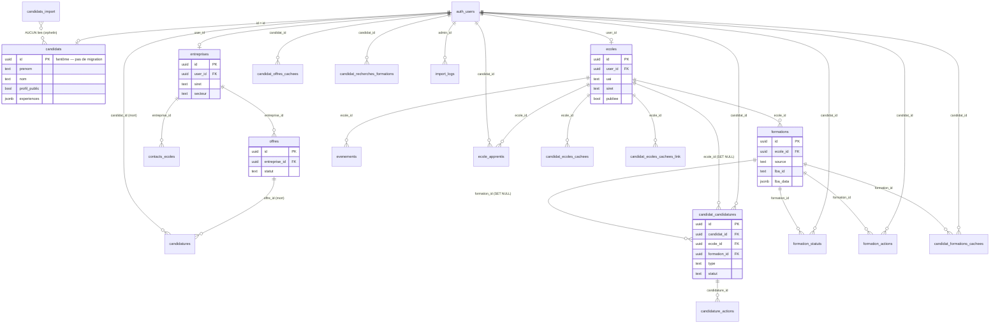

# Modèle de données — Allschool

> Document de cartographie produit à partir des migrations Supabase (`supabase/migrations/001` → `033`) et du code applicatif (`app/`, `components/`, `lib/`).
> Plateforme de mise en relation pour l'alternance, 4 espaces : **Candidat**, **Entreprise**, **École/CFA**, **Backoffice admin**.

---

## 1. Vue d'ensemble

Le modèle repose sur **Supabase** (PostgreSQL + Auth). L'authentification est gérée par `auth.users` (table système Supabase). Chaque acteur (candidat, entreprise, école, admin) est un utilisateur `auth.users` dont le **rôle** est stocké dans `user_metadata.role` (et non dans une table applicative).

Deux sources de données alimentent l'app :
- **Supabase** : tables applicatives (profils, offres, candidatures, suivi…).
- **API La Bonne Alternance (LBA)** : `app/api/alternance` (offres) et `app/api/formations-lba` (formations + écoles). Les formations/écoles affichées dans la recherche viennent majoritairement de LBA *en direct* (non stockées), sauf snapshot lors de l'enregistrement d'une candidature.

### Tables par espace

| Espace | Tables principales |
|--------|--------------------|
| Candidat | `candidats` ⚠️, `candidat_candidatures`, `formation_statuts`, `formation_actions`, `candidature_actions`, `candidat_offres_cachees`, `candidat_formations_cachees`, `candidat_ecoles_cachees`, `candidat_recherches_formations` |
| Entreprise | `entreprises`, `offres`, `candidatures`, `contacts_ecoles` |
| École/CFA | `ecoles`, `formations`, `evenements`, `ecole_apprentis` |
| Backoffice | `candidats_import`, `import_logs` |
| Transverse | `storage.buckets` (`profiles`, `ecoles-media`) |

⚠️ **La table `candidats` n'est créée dans aucune migration** — voir §4.1.

---

## 2. Entités

### 2.1 — `entreprises` *(migration 001, étendue 003, 011)*
Fiche d'une entreprise. Liée à un compte `auth.users` (nullable depuis 003 pour les imports CSV).

| Champ | Type | Rôle |
|-------|------|------|
| `id` | uuid PK | |
| `user_id` | uuid → `auth.users` (nullable) | propriétaire du compte |
| `siret` | text unique | identifiant légal |
| `raison_sociale` | text | nom |
| `secteur` | text | secteur d'activité (texte libre, voir incohérence §5) |
| `adresse`, `ville` | text | localisation (⚠️ `code_postal` manquant en schéma mais utilisé dans le code) |
| `taille` | text CHECK (`tpe`/`pme`/`ge`) | |
| `logo_url`, `photo_url` | text | deux colonnes image redondantes |
| `source` | text default `signup` | origine (`signup`/`csv`) |
| `created_at`, `updated_at` | timestamptz | |

### 2.2 — `offres` *(migration 001, étendue 010, 016)*
Offre d'alternance publiée par une entreprise.

| Champ | Type | Rôle |
|-------|------|------|
| `id` | uuid PK | |
| `entreprise_id` | uuid → `entreprises` ON DELETE CASCADE | |
| `titre` | text NOT NULL | |
| `niveau` | text CHECK (`cap`/`bts`/`bach`/`master`) | ⚠️ liste plus étroite que `lib/niveaux.js` (manque `bac`) |
| `secteur`, `ville`, `description` | text | |
| `statut` | text CHECK (`active`/`inactive`/`pourvue`/`archive`) | |
| `type_offre` | text CHECK (`poste`/`ecole_entreprise`/`campagne`) | |
| `type_contrat` | text[] | apprentissage / professionnalisation |
| `competences`, `missions`, `recherche` | text | |
| `soft_skills` | text[] | |
| `email_contact`, `telephone_contact`, `url_candidature` | text | |
| `date_prise_poste` | date | |
| `preference_ecole` | boolean | |
| `created_at`, `updated_at` | timestamptz | |

### 2.3 — `candidatures` *(migration 001)* — ⚠️ table morte
Candidature d'un candidat sur une offre Allschool. **Aucune référence dans le code** (`grep .from('candidatures')` = 0). Remplacée fonctionnellement par `candidat_candidatures`.

| Champ | Type | Rôle |
|-------|------|------|
| `id` | uuid PK | |
| `offre_id` | uuid → `offres` CASCADE | |
| `candidat_id` | uuid → `auth.users` CASCADE | |
| `statut` | text CHECK (`new`/`vue`/`contact`/`refus`) | |
| `message` | text | |
| unique(offre_id, candidat_id) | | |

### 2.4 — `contacts_ecoles` *(migration 001)* — ⚠️ table morte + FK suspecte
Mise en relation entreprise → école. **Non utilisée dans le code.**

| Champ | Type | Rôle |
|-------|------|------|
| `id` | uuid PK | |
| `entreprise_id` | uuid → `entreprises` CASCADE | |
| `ecole_id` | uuid → **`auth.users`** ON DELETE SET NULL | ⚠️ référence `auth.users` au lieu de `ecoles` |
| `nom_ecole`, `message` | text | |
| `statut` | text CHECK (`envoye`/`repondu`/`archive`) | |

### 2.5 — `ecoles` *(migration 002, fortement étendue 004→033)*
Référentiel/annuaire des écoles & CFA. Source de vérité hybride : LBA (factuel) + enrichissement Supabase.

| Champ | Type | Rôle |
|-------|------|------|
| `id` | uuid PK | |
| `user_id` | uuid → `auth.users` (nullable) | compte école si partenaire |
| `nom`, `raison_sociale` | text | |
| `type_ecole` | text | "CFA public", "École privée"… |
| `uai` | text unique | identifiant Éducation nationale |
| `siret` | text unique | fallback identifiant légal |
| `adresse`, `code_postal`, `ville`, `region`, `academie` | text | localisation |
| `latitude`, `longitude` | float | géocodage (fonction `ecoles_dans_rayon`) |
| `nb_etudiants` | int | |
| `description`, `site_web`, `linkedin` | text | |
| `email`, `telephone`, `email_contact` | text | ⚠️ `email` (académique) vs `email_contact` (commercial) |
| `qualiopi` | boolean | |
| `logo_url`, `cover_url`, `avatar_url` | text | ⚠️ 3 colonnes image (`logo_url` jamais utilisé dans le code) |
| `modalites` | text[] | `presentiel`/`distanciel`/`hybride` |
| `secteurs` | text[] | secteurs d'activité |
| `initiatives` | text[] | engagements |
| `publiee` | boolean default false | fiche en ligne ou non |
| `source` | text CHECK (`lba`/`allschool`/`partenaire`) | ⚠️ le code écrit aussi `csv`/`catalogue`/`signup`/`manuel` → viole le CHECK (§5) |
| `created_at`, `updated_at` | timestamptz | |

### 2.6 — `formations` *(migration 002, étendue 003→032)*
Formation rattachée à une école. Source `allschool` (CSV, supprimées en 028) ou `lba` (snapshot).

| Champ | Type | Rôle |
|-------|------|------|
| `id` | uuid PK | |
| `ecole_id` | uuid → `ecoles` CASCADE (nullable depuis 027) | |
| `nom` | text NOT NULL | |
| `niveau` | text CHECK (`cap`,`bac`,`bts`,`bts_agri`,`afpa3`,`deust`,`niv3`,`bach`,`master`,`autre`) | |
| `diplome` | text | libellé diplôme |
| `nb_apprentis`, `taux_presentation`, `taux_reussite` | int | stats |
| `modalite` | text CHECK (`presentiel`/`distanciel`/`hybride`) | |
| `url_onisep`, `localite_formation` | text | |
| `source` | text default `allschool` | `allschool`/`lba` |
| `lba_id` | text unique partiel | clé ministère éducatif LBA |
| `lba_data` | jsonb | snapshot brut LBA complet |
| `created_at` | timestamptz | ⚠️ pas de `updated_at` malgré upsert sur `lba_id` |

### 2.7 — `evenements` *(migration 002)*
Événement d'une école (JPO, etc.).

| Champ | Type |
|-------|------|
| `id` uuid PK · `ecole_id` → `ecoles` CASCADE · `titre` text · `date_event` date · `lieu` text · `meta` text · `created_at` |

### 2.8 — `ecole_apprentis` *(migration 002)*
Rattachement d'un candidat à une école (apprentis suivis par l'école).

| Champ | Type | Rôle |
|-------|------|------|
| `id` uuid PK | | |
| `ecole_id` | uuid → `ecoles` CASCADE | |
| `candidat_id` | uuid → `auth.users` CASCADE | ⚠️ référence `auth.users`, pas `candidats` ; mais le code joint `candidat:candidats(...)` |
| `statut` | text CHECK (`cherche`/`signe`) | |
| `top_profil` | boolean | mise en avant |
| unique(ecole_id, candidat_id) | | |

### 2.9 — `candidats` *(JAMAIS créée en migration — voir §4.1)*
Profil candidat. **Table fantôme** : seulement modifiée par `ALTER` (011, 013, 014, 015, 024, 025) ; le `CREATE TABLE` n'existe nulle part dans le dépôt. Champs reconstitués depuis le code :

| Champ | Type (déduit) | Source / Rôle |
|-------|---------------|---------------|
| `id` | uuid PK (= `auth.users.id`) | clé = utilisateur |
| `prenom`, `nom`, `ville`, `formation`, `disponibilite`, `bio` | text | base profil |
| `passions`, `loisirs` | text[] | centres d'intérêt |
| `photo_url` | text | migration 011 |
| `profil_public` | boolean | visibilité entreprises (⚠️ jamais dans une migration) |
| `experiences` | jsonb `[]` | migration 013 |
| `competences_hard` | text | 013 |
| `competences_soft` | text[] | 013 |
| `niveau_etudes` | text | 013 |
| `langues` | jsonb `[]` | 013 |
| `linkedin_url` | text | 013 |
| `permis` | boolean | 013 |
| `dispo_mois`, `dispo_annee` | smallint | 014 |
| `profil_en_pause`, `profil_visible_ecoles`, `masquer_experiences`, `pas_experience_pro` | boolean | 014 |
| `email`, `telephone` | text | 015 |
| `alternance_trouvee` | boolean | 024 |
| `cv_masquer_apropos`, `cv_masquer_competences_hard`, `cv_masquer_soft_skills`, `cv_masquer_langues`, `cv_masquer_interets` | boolean | 025 |
| `updated_at` | timestamptz | utilisé par le code |

### 2.10 — `candidat_candidatures` *(migration 009, étendue 019→023)*
Tracker de candidatures du candidat (toutes sources : offres + formations).

| Champ | Type | Rôle |
|-------|------|------|
| `id` | uuid PK | |
| `candidat_id` | uuid → `auth.users` CASCADE | |
| `type` | text CHECK (`allschool`,`externe`,`spontanee`,`prospection`,`sourcee`,`ecole`,`formation`) | |
| `nom_entreprise` | text NOT NULL | (renommé depuis `nom` en 019) |
| `poste`, `url`, `notes` | text | |
| `statut` | text CHECK (`a_faire`,`envoyee`,`entretien`,`admis`,`archive`) | |
| `ecole_id` | uuid → `ecoles` SET NULL | candidature liée à une école |
| `formation_id` | uuid → `formations` SET NULL | candidature liée à une formation |
| `created_at`, `updated_at` | timestamptz | trigger `set_updated_at` |

### 2.11 — Suivi candidat (tables annexes)

| Table | Migration | Rôle | Clés |
|-------|-----------|------|------|
| `formation_statuts` | 012 | statut posé par un candidat sur une formation | `candidat_id`→auth.users, `formation_id`→formations, unique(candidat,formation) ; `statut` text **sans CHECK** |
| `formation_actions` | 012 | rappel/action sur une formation | idem + `texte`, `echeance`, `fait` |
| `candidature_actions` | 026 | rappel/action sur une candidature | `candidature_id`→`candidat_candidatures`, unique(candidat,candidature) |
| `candidat_offres_cachees` | 018 | offres masquées ("ne plus voir") | `offre_id` **text** (id LBA/allschool), `offre_data` jsonb snapshot |
| `candidat_formations_cachees` | 022 | formations masquées | `formation_id`→formations, `formation_data` jsonb |
| `candidat_ecoles_cachees` | 021 | écoles masquées | `ecole_id`→ecoles, `ecole_data` jsonb |
| `candidat_recherches_formations` | 031 | recherches sauvegardées | `filtres` jsonb |

### 2.12 — Backoffice

| Table | Migration | Rôle |
|-------|-----------|------|
| `candidats_import` | 003 | profils importés via CSV, **sans compte auth** (jamais reliés à `candidats`) ⚠️ table orpheline |
| `import_logs` | 003 | journal des imports CSV (`type`, `total`, `ok`, `warn`, `errors_count`, `admin_id`) |

### 2.13 — Storage (buckets)
- `profiles` *(migration 011)* : public, photos candidats/entreprises. Policies trop permissives (§ AUDIT).
- `ecoles-media` : utilisé par `PanelEcole.jsx` (cover/avatar) — **aucune migration ne le crée** (créé à la main, comme `candidats`).

---

## 3. Schéma relationnel (Mermaid)

> Note : `candidat_id` pointe partout vers `auth.users(id)` et non vers `candidats(id)`, alors que `candidats.id = auth.users.id`. Les jointures `candidat:candidats(...)` fonctionnent par égalité d'`id`, mais **aucune FK** ne relie ces tables à `candidats` (voir §5).

---

## 4. Incohérences structurelles

### 4.1 — `candidats` : table non versionnée (CRITIQUE)
La table la plus utilisée du projet (19 accès dans le code) **n'a aucun `CREATE TABLE`** dans les migrations. Elle a été créée manuellement dans le dashboard Supabase. Conséquences :
- Schéma source de vérité = code + dashboard, non reproductible (impossible de recréer la base depuis `supabase/migrations`).
- **RLS inconnue / non versionnée.** Or le code lit `email`, `telephone` côté client dans l'espace entreprise et backoffice → si la policy SELECT est `using (true)`, **fuite de données personnelles** (voir AUDIT).
- Idem pour le bucket storage `ecoles-media`.

### 4.2 — Clés étrangères incohérentes vers `auth.users`
`candidat_id` référence `auth.users` partout (candidatures, statuts, actions, rattachements, masquages) alors que la table métier est `candidats`. Une suppression de profil `candidats` ne cascade pas (la FK est sur `auth.users`). `ecole_apprentis.candidat_id` et `contacts_ecoles.ecole_id` pointent vers `auth.users` plutôt que vers la table métier attendue.

### 4.3 — `contacts_ecoles.ecole_id → auth.users`
Devrait pointer vers `ecoles(id)`. Champ `nom_ecole` text en doublon de la relation. Table morte de toute façon.

### 4.4 — Tables mortes / orphelines
- `candidatures` (001) : remplacée par `candidat_candidatures`, plus aucune lecture/écriture.
- `contacts_ecoles` (001) : jamais utilisée.
- `candidats_import` (003) : alimentée par l'import CSV apprentis, mais **jamais reliée à `candidats`** ni lue ailleurs → données importées inaccessibles depuis l'app.

### 4.5 — Numéros de migration dupliqués
Quatre collisions : `003` (backoffice / niveau_bac), `005` (ecole_publiee / modalite_formation), `006` (ecole_media_actus / ecoles_modalites), `007` (ecole_secteurs / niveau_bts_split). L'ordre d'exécution devient ambigu (dépend du tri alphabétique), fragile pour `supabase db push`.

### 4.6 — Colonnes ajoutées plusieurs fois
- `ecoles.cover_url` : 002 et 006. `ecoles.uai`/`adresse`/`code_postal` : 004 et 030. `ecoles.region`/`academie` : 004 et 033. `ecoles.source` : 003, 004 (default `manuel`), 033 (default `allschool` + CHECK). Le `IF NOT EXISTS` masque le problème mais le default final dépend de l'ordre.

### 4.7 — Champs image redondants
- `entreprises` : `logo_url` + `photo_url` (seul `photo_url` utilisé).
- `ecoles` : `logo_url` + `cover_url` + `avatar_url` (`logo_url` jamais lu ; le code utilise `cover_url` et `avatar_url`).

### 4.8 — `candidats_import` vs `candidats` : champs dupliqués
`candidats_import` redéfinit `nom`, `prenom`, `email`, `ville`, `telephone`, `secteur`, `disponibilite`, `teletravail`, `ecole_rattachee` — recouvrant partiellement `candidats` sans pont entre les deux.

---

## 5. Incohérences de nommage et de typage

| Sujet | Problème |
|-------|----------|
| **`source` des écoles** | CHECK (033) n'autorise que `lba`/`allschool`/`partenaire`, mais `app/api/admin/import` écrit `source='csv'` et `source='catalogue'`, et 003 met default `signup`. Tout import viole le CHECK → **erreur SQL au runtime** sur ces inserts. |
| **`niveau` des offres** | `offres.niveau` CHECK = `cap`/`bts`/`bach`/`master` (manque `bac`), alors que `lib/niveaux.js` (source de vérité) inclut `bac`. Le formulaire entreprise propose `bac` → insert rejeté. |
| **Secteurs** | 3 listes divergentes : `lib/secteurs.js` (24 secteurs, à jour), `PanelBackDetail.jsx` `SECTEURS_LIST` (15 anciens secteurs hardcodés), et les valeurs ROME de `lib/rome-mapping.js`. Migration 017 renomme 4 secteurs côté `ecoles` mais pas côté `entreprises`. |
| **fr/en mélangés** | Majorité français (`raison_sociale`, `niveau`, `publiee`), mais `source`, `top_profil`, `created_at`/`updated_at`, `statut` valeurs `new`/`vue` (candidatures morte). `linkedin_url` (snake) vs `linkedin` (ecoles). |
| **`statut` sans contrainte** | `formation_statuts.statut` est text libre, alors que les valeurs viennent d'une liste fermée (`STATUTS` dans `PanelFormationPublique.jsx`). Aucune protection DB. |
| **Deux nomenclatures de statut formation** | `formation_statuts` utilise `favori`/`candidature_faire`/`postule`/`en_attente`/`accepte`/`pas_interesse` (6 clés, `PanelFormationPublique`) ; `candidat_candidatures` utilise `a_faire`/`envoyee`/`entretien`/`admis`/`archive` (5 clés). Deux systèmes de suivi parallèles pour des formations. |
| **`offre_id` typé text** | `candidat_offres_cachees.offre_id` est text (préfixé `lba-`/`allschool-`) — choix volontaire pour mixer les sources, mais pas de FK ni d'intégrité. |
| **`code_postal` entreprises** | Lu/écrit par le code (`AdresseField`) mais absent du schéma `entreprises` (jamais ajouté par migration) → écriture probablement perdue ou colonne créée à la main. |

---

## 6. Entités implicites (manipulées sans table/type propre)

Objets structurés présents uniquement dans le code ou en JSON, sans table ni type TypeScript :

| Entité implicite | Où | Forme |
|------------------|-----|-------|
| **Formation LBA normalisée** | `app/api/formations-lba` `normalizeFormation()` | objet ~30 champs (`lba_id`, `ecole_nom`, `uai`, `sessions[]`, `entierement_distance`, `niveau`, `diplome_label`…), passé au client, stocké tel quel dans `formations.lba_data` |
| **Offre LBA normalisée** | `app/api/alternance` `normalizeJob()` | `{id, source, tag, titre, entreprise, ville, contrat, url, niveau…}` |
| **Expérience pro** | `candidats.experiences` (jsonb) | `{id, entreprise, poste, contrat, ville, mois_debut, annee_debut, mois_fin, annee_fin, en_cours, missions[]}` |
| **Langue** | `candidats.langues` (jsonb) | `{id, langue, niveau}` |
| **École regroupée** | `PanelCandidatEcoles.grouperParEcole()` | agrégat de formations LBA par UAI/SIRET → "école" virtuelle non persistée |
| **Recherche sauvegardée (filtres)** | `candidat_recherches_formations.filtres` (jsonb) | `{keyword, secteur, niveau, modalite, ville, rayon, geoSel}` |
| **Snapshot offre/formation masquée** | `*_cachees.*_data` (jsonb) | copie d'affichage figée |
| **Badge / Palier** | `PanelCandidatBadges.jsx` | calculés à la volée, jamais persistés (`profil_complete`, paliers d'offres…) |
| **Rôle utilisateur** | `auth.users.user_metadata.role` | `candidat`/`entreprise`/`ecole`/`admin` — **pas de table de rôles**, valeur modifiable côté client (faille, voir AUDIT) |
| **Secteur ↔ ROME** | `lib/rome-mapping.js` | mapping secteur Allschool → codes ROME, en dur dans le code |
| **Avis écoles** | `PanelEcoleDashboard` génère des URLs `allschool.fr/avis/...` | fonctionnalité annoncée, aucune table |

---

## 7. Synthèse des problèmes prioritaires de modèle

1. **`candidats` et le bucket `ecoles-media` non versionnés** → base non reproductible, RLS hors contrôle (CRITIQUE).
2. **CHECK `ecoles.source` incompatible avec les imports** → inserts CSV/catalogue cassés.
3. **CHECK `offres.niveau` sans `bac`** → dépôt d'offre niveau Bac Pro rejeté.
4. **FK `candidat_id → auth.users`** partout au lieu de `candidats` → pas d'intégrité référentielle sur les profils.
5. **Tables mortes** (`candidatures`, `contacts_ecoles`) et **orpheline** (`candidats_import`) à supprimer ou raccorder.
6. **Numéros de migration dupliqués** → réordonner/renommer pour fiabiliser `db push`.

> Les corrections de modèle proposées sont détaillées dans `AUDIT.md` (§ Modèle) et appliquées via migrations réversibles dans `SYNTHESE.md`.
